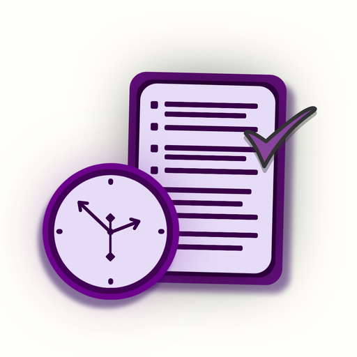
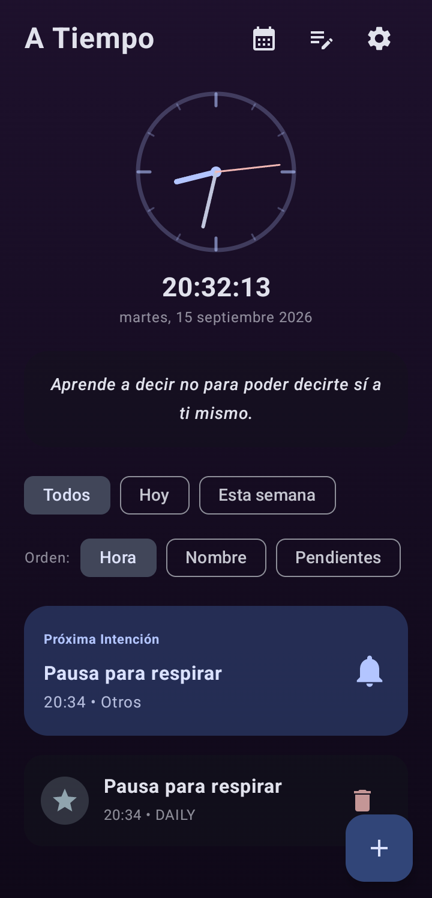
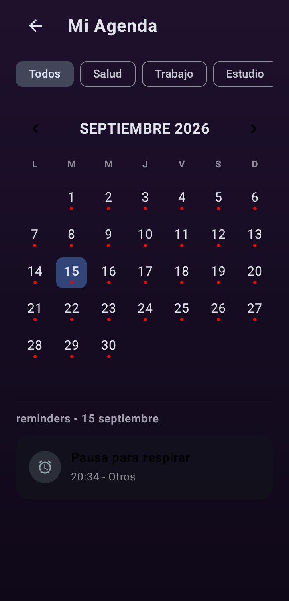
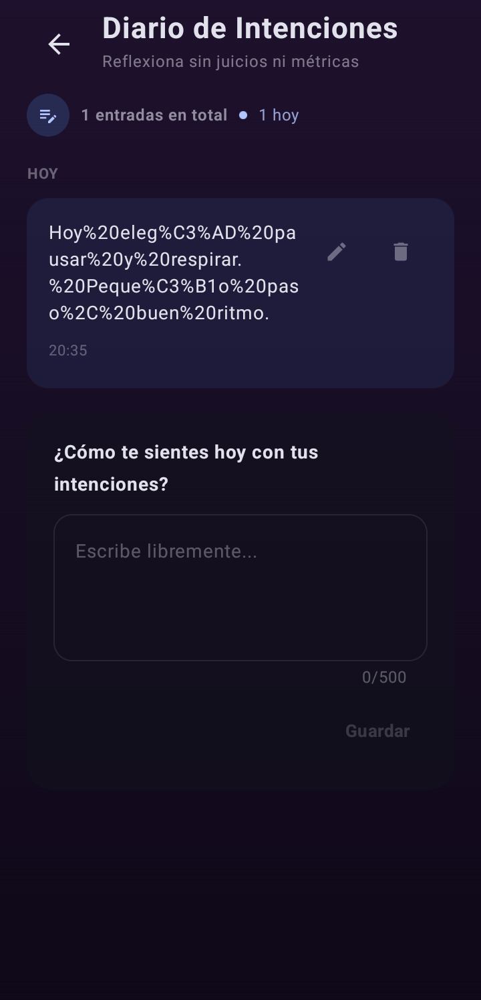
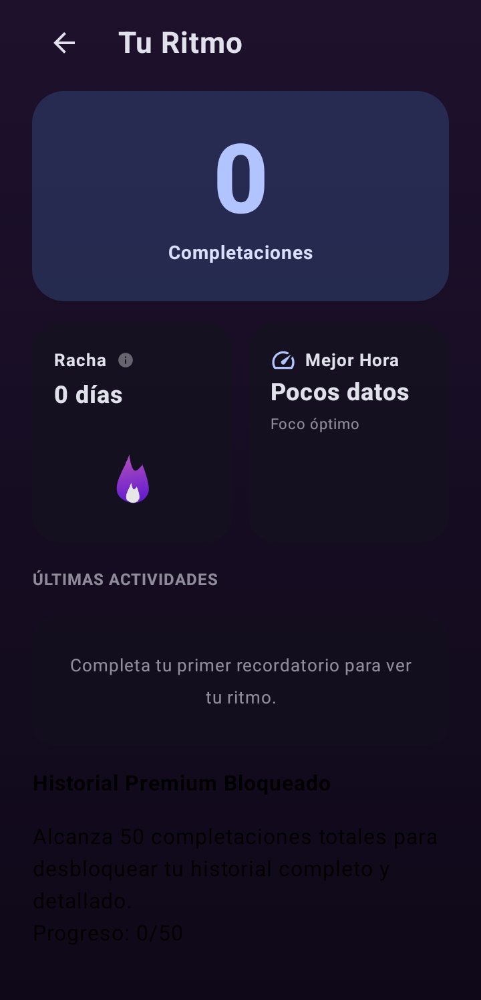
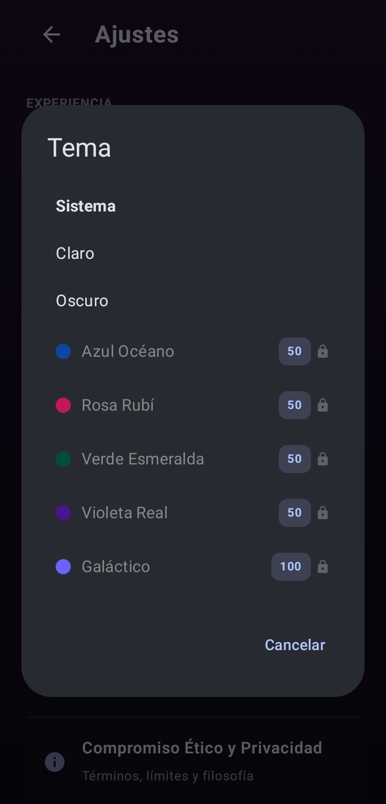
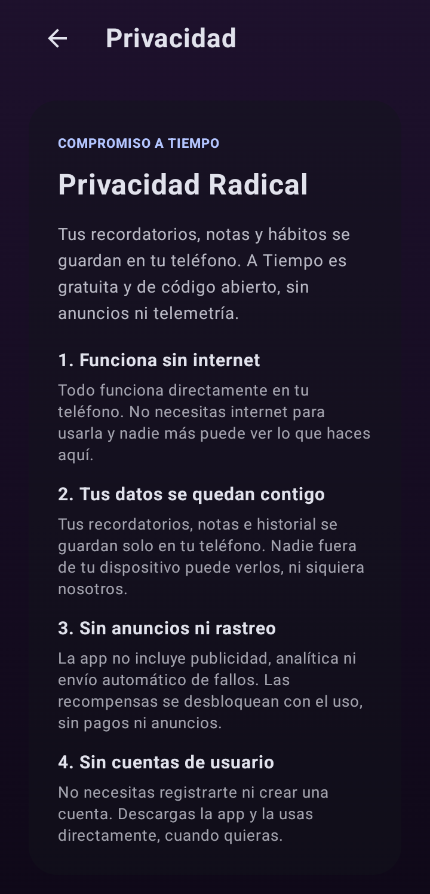

<p align="center">
  
</p>

<h1 align="center">A Tiempo</h1>
<p align="center"><strong>Recordatorios con intención. Hábitos a tu ritmo.</strong></p>
<p align="center">Android nativo · Sin anuncios · Sin cuentas · Datos locales</p>
<p align="center">
  
  
  
  
</p>

---

**A Tiempo** convierte tus pequeñas intenciones diarias en una rutina consciente.
Organiza recordatorios, consulta tu agenda, escribe un diario y descubre nuevas
formas de personalizar tu espacio mientras avanzas. Sin suscripciones, publicidad
ni servicios de seguimiento.

**[Ver la app](#una-mirada-a-la-app)** · **[Instalar](#instalar-la-edición-de-prueba)** ·
**[Compilar](#compilar-desde-el-código)** · **[Contribuir](CONTRIBUTING.md)** ·
**[Privacidad](PRIVACY.md)**

## Una mirada a la app

Capturas reales de la edición de prueba ejecutada en un teléfono Android por USB.
Los ejemplos son ficticios. Se recortan las barras del sistema para no mostrar
información personal del dispositivo.

<p align="center">
  
  
  
</p>
<p align="center">
  
  
  
</p>

## Un espacio para tu día

### Recordatorios que se adaptan a ti

- Intenciones puntuales, diarias, semanales o mensuales.
- Hora, categoría, iconos, notas y vibración personalizables.
- Creación rápida desde el reloj de inicio.
- Notificaciones con acciones para completar o desactivar.
- Avisos de seguimiento y estado de vencimiento.

### Perspectiva sin presión

- **Mi Agenda:** calendario mensual con filtros por categoría.
- **Tu Ritmo:** actividad reciente, rachas y mejor hora del día.
- **Diario:** reflexiones privadas con entradas de hasta 500 caracteres.
- **Widgets:** próximas intenciones y resumen de actividad en el inicio de Android.

### Personalización que se gana con constancia

Todas las personas tienen la misma edición gratuita. «Premium» es el nombre de
las recompensas visuales; **no existe una modalidad de pago**.

- **Desde el inicio:** temas Sistema, Claro y Oscuro; recordatorios, agenda,
  diario, estadísticas básicas y actividad reciente.
- **50 intenciones completadas:** temas Azul Océano, Rosa Rubí, Verde Esmeralda,
  Violeta Real e historial detallado.
- **100 intenciones completadas:** tema Galáctico animado.

El progreso se consigue completando intenciones a lo largo del uso. No basta
con dejar pasar días desde la instalación y no hay atajos por compras o anuncios.
Una misma intención no suma dos veces en el mismo día. Borrar todos los datos
restablece también las recompensas. Los bloqueos se mantienen en la edición de prueba.

### Siete idiomas

Español · English · हिन्दी · 简体中文 · العربية · Português · Français.

## Instalar la edición de prueba

Los archivos preparados para distribución se generan en `dist/`:

- **`a-tiempo-1.0-preview.apk`** — instalador para Android 7.0 o posterior.
- **`a-tiempo-source.zip`** — código y documentación sin historial ni archivos privados.
- **`SHA256SUMS.txt`** — sumas de comprobación de ambos archivos.

Si estás consultando un repositorio publicado, busca estos archivos en su sección
**Releases**. El código fuente no contiene el APK: se adjunta por separado al lanzamiento.

1. Descarga el APK y, si lo deseas, comprueba su SHA-256.
2. Ábrelo en Android y permite la instalación desde esa fuente.
3. Elige el idioma y completa la bienvenida.
4. Autoriza notificaciones y alarmas exactas para recibir los recordatorios.

La preview utiliza el identificador `com.atiempo.app.preview`, por lo que puede
convivir con una instalación anterior sin reemplazar sus datos. Está firmada con
una clave de desarrollo y es **una versión para evaluación**, no una release
de producción. Las compilaciones de otras máquinas pueden tener otra firma.

```powershell
adb install -r dist/a-tiempo-1.0-preview.apk
Get-FileHash dist/a-tiempo-1.0-preview.apk -Algorithm SHA256
```

Consulta [la guía de pruebas](docs/TESTING.md) y [las notas de versión](CHANGELOG.md).

## Privacidad por diseño

La edición abierta no integra SDK de anuncios, Firebase Analytics ni Crashlytics.
El manifiesto principal no solicita Internet ni identificador publicitario.
Recordatorios e historial se guardan en Room; las preferencias permanecen en el
almacenamiento privado de Android. Las copias automáticas y la transferencia de
datos están deshabilitadas mediante las reglas de Android.

No hay sincronización en la nube ni recuperación remota. Desinstalar la app o
borrar sus datos elimina el contenido local. Android puede mostrar los textos
de las notificaciones en la pantalla de bloqueo según tu configuración.
Más detalles en [PRIVACY.md](PRIVACY.md).

## Compilar desde el código

### Requisitos

- JDK 17 o compatible con Gradle 9.3.1 y Android Gradle Plugin 9.1.1.
- Android SDK Platform 36 y herramientas de compilación instaladas.
- Android Studio compatible con AGP 9.1, o herramientas de línea de comandos.
- Internet para descargar dependencias durante la primera compilación.
- Python 3.10+ solo para preparar el paquete público; Pillow para capturas.

Abre la carpeta del proyecto en Android Studio o configura `ANDROID_HOME` con
tu SDK. También puedes usar un `local.properties` local, excluido de Git.
No se necesitan API keys, cuenta de Firebase ni un archivo `.env`.

```powershell
# Windows
.\gradlew.bat :app:assembleDebug
.\gradlew.bat :app:testDebugUnitTest :app:lintDebug
python scripts/package_public.py
```

```bash
# Linux / macOS
chmod +x gradlew
./gradlew :app:assembleDebug
./gradlew :app:testDebugUnitTest :app:lintDebug
python3 scripts/package_public.py
```

El APK original se genera en `app/build/outputs/apk/debug/app-debug.apk`.
La variante `release` usa `com.atiempo.app`, optimización y reducción de recursos.
Para firmarla, exporta `KEYSTORE_PATH`, `KEY_ALIAS`, `STORE_PASSWORD` y
`KEY_PASSWORD` en el entorno. `.env.example` es una referencia y no se carga
automáticamente. Sin esas variables, la release se genera sin firmar.

```powershell
.\gradlew.bat :app:assembleRelease
```

## Arquitectura

Aplicación de una actividad, UI declarativa con **Jetpack Compose**, navegación
con Navigation Compose y estado con **ViewModel + StateFlow**. **Room** conserva
los datos y **AlarmManager** programa los recordatorios.

```text
app/src/main/java/com/example/
├── data/           # Persistencia, preferencias y reglas de recompensas
├── receiver/       # Alarmas, reinicio y acciones de notificación
├── ui/
│   ├── components/ # Reloj, fondos y diálogos
│   ├── screens/    # Inicio, agenda, diario, ajustes y estadísticas
│   ├── theme/      # Temas básicos y desbloqueables
│   ├── translation/
│   └── viewmodel/
├── util/           # Planificación de alarmas
└── widget/         # Widgets de Android
```

Las versiones exactas están en `gradle/libs.versions.toml`.

## Participar

Las mejoras pequeñas y verificables son bienvenidas: accesibilidad, traducciones,
pruebas en distintos Android y correcciones de notificaciones. Abre un issue con
pasos reproducibles o envía una propuesta siguiendo [CONTRIBUTING.md](CONTRIBUTING.md).
No adjuntes diarios, bases de datos, claves de firma ni datos personales.

## Licencias y créditos

El código original se publica bajo **[MIT](LICENSE)**.
El logo es una creación original aportada al proyecto. Las animaciones provienen
de LottieFiles y conservan su licencia propia; las bibliotecas también conservan
sus licencias. Consulta [THIRD_PARTY_NOTICES.md](THIRD_PARTY_NOTICES.md) para el
inventario y los detalles de procedencia aún por completar.

---

<p align="center"><em>Un pequeño paso, a tu tiempo.</em></p>
